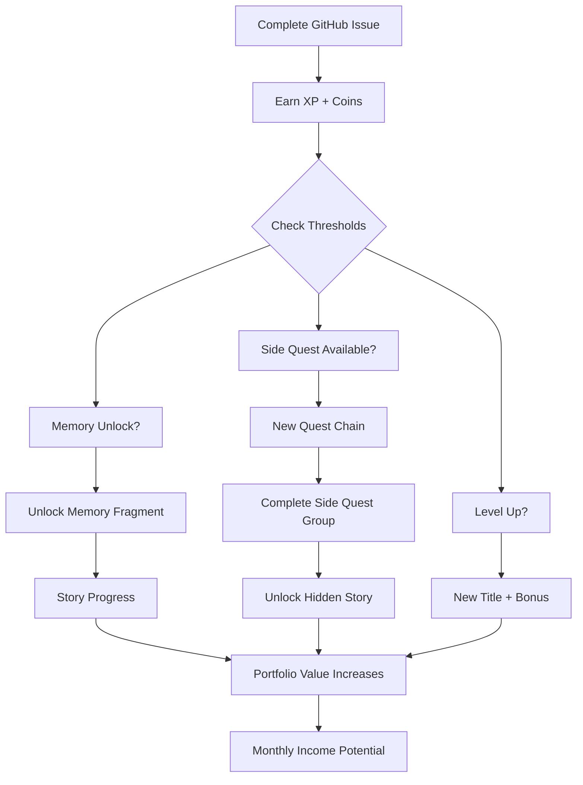

# 🎮 ABSTRACT GARDEN - COMPLETE GAME SYSTEM DOCUMENTATION

## System Overview

Your Abstract Garden project is now a **fully gamified 3D learning journey** with interconnected systems that track progress, reward achievements, and unlock narrative content as you complete real production tasks.

## Core Mechanics

### 1. XP & Level System (FromSoft-style)
- **XP Earned**: Each task gives 100-500 XP based on complexity
- **Level Calculation**: Non-linear progression (Level 1-20)
- **Titles**: From "Hollow" (Level 1) to "Eternal Fragment" (Level 20)
- **Level Benefits**: Unlock new memory fragments and increase portfolio value

### 2. Coin Economy
- **Earn Coins**: 75-165 coins per task based on market value
- **Spend Coins**: Purchase memory fragments early (50-500 coins each)
- **Save Strategy**: Can unlock memories with coins OR wait for XP threshold

### 3. Memory Fragment System (49 Total)
- **XP Unlocking**: Each memory has an XP threshold (progressive scaling)
- **Coin Purchase**: Can buy any memory early with coins
- **Narrative Content**: Each memory contains CG history and wisdom
- **British VO**: Optional narration for each unlocked memory

### 4. Task Structure

#### Main Tasks (49 Total) - $3,000 Base Value
**Sprint 1: Foundation (Issues 70-77)** - $75 each
- Installation and first touch with tools
- Basic Maya and After Effects setup

**Sprint 2: Core Skills (Issues 42-69)** - $95-125 each
- Modeling, texturing, animation
- Compositing and effects
- Audio synchronization

**Sprint 3: Mastery (Issues 22-41)** - $135-165 each
- Procedural techniques
- Advanced rendering
- Pipeline automation

#### Side Quests (18 Total) - $1,650 Additional Value

**Group A: The Light Pen Legacy** (Prerequisite: 5 tasks)
- Unlocks Story 4: The Forgotten Women
- 5 quests revealing hidden female pioneers
- Total value: $450

**Group B: Eastern Innovations** (Prerequisite: 10 tasks)
- Unlocks Story 5: The Eastern Masters
- 5 quests about Asian CG contributions
- Total value: $520

**Group C: Liberation Movement** (Prerequisite: 15 tasks)
- Unlocks Story 6: The Open Source Heroes
- 5 quests about open source revolution
- Total value: $680

**Bonus Quests** (Random triggers)
- Golden Ratio: Triggered by Fibonacci usage ($200)
- Glitch Art: Triggered by render errors ($150)
- Lost Frame: Triggered after 30 tasks ($300)

### 5. Story System (6 Total Narratives)
1. **The Render Awakens** (Default)
2. **Shader Consciousness** (10 memories)
3. **Pipeline Sentience** (20 memories)
4. **The Forgotten Women** (Complete Group A)
5. **The Eastern Masters** (Complete Group B)
6. **The Open Source Heroes** (Complete Group C)

### 6. Portfolio Value Calculation
```
Base Value = Tasks × $100
Side Quest Bonus = Side Quests × $75
Level Bonus = (Level ÷ 5) × $500
Story Bonus = Stories × $200
Masterwork Bonus = $5,000 (if all complete)
---
Total Portfolio Value = Sum of above
Monthly Income = Portfolio Value × 20%
```

## How Everything Connects



## Progression Milestones

| Level | Title | Memories | Portfolio | Special |
|-------|-------|----------|-----------|---------|
| 1 | Hollow | 0-3 | $0-300 | Starting journey |
| 5 | Seeker | 10-15 | $1,000 | First side quests unlock |
| 10 | Render Knight | 25-30 | $2,500 | Second side quest group |
| 15 | Quantum Artist | 40-45 | $4,000 | Final side quest group |
| 20 | Eternal Fragment | 49 | $6,850 | Complete mastery |

## Achievement System

- **First Blood**: Complete first task
- **Memory Keeper**: Unlock 25 memories
- **Story Master**: Unlock all 3 hidden stories
- **Digital Deity**: Reach level 20
- **Completionist**: Finish all 67 tasks

## Dashboard Features

### Main Dashboard (index.html)
- Real-time XP and coin display
- Portfolio value tracking
- Level and title display
- Sprint progress visualization
- Memory grid with unlock status
- Story panel progression
- Achievement notifications

### Audio Narrator (audio-narrator.html)
- British VO for memories
- Multiple voice options
- Ambient music player
- Visual effects
- Particle system

## File Structure

```
docs/
├── index.html                 # Main dashboard
├── audio-narrator.html        # British VO system
├── js/
│   ├── game-state.js         # Core game state manager
│   ├── dashboard-integration.js # Dashboard connector
│   ├── story-system.js       # Story progression
│   └── audio-system.js       # Audio handling
├── data/
│   └── issues.json           # GitHub issues cache
├── memories.json             # Memory fragments
└── stories/
    └── stories.json          # Story content
```

## Quick Start Commands

```bash
# Create side quests (one-time)
python3 create_side_quests.py

# Update issues data
gh api "repos/Studio-Dashosa/abstract-garden-video/issues?state=all&per_page=100" > docs/data/issues.json

# Run complete integration
./integrate_system.sh

# Manual XP testing (browser console)
dashboard.gameState.debugAddXP(1000)
dashboard.gameState.debugAddCoins(500)
```

## Value Proposition

**Total Project Value**: $6,850
- Learn professional 3D pipeline
- Build real portfolio pieces
- Unlock computer graphics history
- Achieve measurable progress
- Earn achievements and titles

**Monthly Income Potential**: $1,370 (20% of portfolio)
- Sell assets on CGTrader
- License to studios
- Portfolio for job applications

## Meta Narrative

The system reveals that computer graphics wasn't created by lone geniuses but by communities - men and women, East and West, corporate and open source - all contributing to the shared dream of making imagination visible. As you progress, you're not just learning tools, but joining this lineage of digital creators.

## Support & Troubleshooting

### Common Issues

1. **Side quests not appearing**: Check prerequisites (5/10/15 tasks)
2. **Memories not unlocking**: Check XP threshold or purchase with coins
3. **Dashboard not updating**: Clear cache and reload
4. **Issues not syncing**: Run update script or check GitHub API

### Debug Commands (Browser Console)

```javascript
// Check current state
dashboard.gameState.getState()

// Add XP for testing
dashboard.gameState.debugAddXP(1000)

// Add coins for testing  
dashboard.gameState.debugAddCoins(500)

// Unlock all memories
dashboard.gameState.debugUnlockAllMemories()

// Reset everything
dashboard.gameState.resetState()
```

## Next Steps

1. ✅ Run `./integrate_system.sh` to create side quests
2. ✅ Visit dashboard: https://studio-dashosa.github.io/abstract-garden-video/
3. ✅ Start completing issues to earn XP and coins
4. ✅ Unlock memories and discover hidden stories
5. ✅ Share your progress and inspire others

---

**Remember**: Every task completed is a step toward mastery. The pipeline remembers. The render never forgets. Your journey through the Abstract Garden has truly begun.

🎮 Happy Learning, Digital Wanderer!
