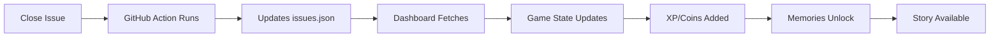

# 🎮 HOW ABSTRACT GARDEN ACTUALLY WORKS

## It's Like Azure DevOps + Dark Souls + Duolingo

Think of it as a **gamified Kanban board** where completing 3D animation tasks earns you XP and unlocks stories about computer graphics history.

---

## 🎯 THE SIMPLE VERSION

### What It Is:
- **A GitHub Issues board** (like Jira/Azure DevOps)
- **Turned into a game** (like Duolingo streaks)
- **With Dark Souls aesthetics** (gothic, challenging, rewarding)
- **That teaches 3D animation** (Blender, Maya, Houdini tasks)

### How It Works:
```
1. GitHub Issue = Quest
2. Complete Issue = Get XP + Coins
3. XP Unlocks = Memory Fragments (CG history stories)
4. All Issues Done = Portfolio Worth $6,850
```

---

## 📋 COMPARISON TO OTHER TOOLS

| Feature | Azure DevOps | Jira | Abstract Garden |
|---------|--------------|------|----------------|
| Task Tracking | ✅ | ✅ | ✅ |
| Kanban Board | ✅ | ✅ | ✅ (GitHub Projects) |
| Points System | Story Points | Story Points | XP + Coins |
| Rewards | None | None | Unlock Stories |
| Progress Viz | Burndown Chart | Velocity | FromSoft UI |
| Learning | No | No | CG History |
| Portfolio Value | No | No | Yes ($6,850) |

---

## 🔄 THE ACTUAL WORKFLOW

### Step 1: Pick a Task
```
GitHub Issues Page → Filter by "Sprint 1" → Pick one like:
- Issue #70: "Install Blender"
- Issue #71: "Create first cube"
- Issue #72: "Apply first material"
```

### Step 2: Do the Work
**MOST TASKS DON'T NEED UPLOADS!** They're learning milestones:
- "Install software" = Just comment "Done, installed v3.0"
- "Follow tutorial" = Comment "Completed, learned about nodes"
- "Create test render" = Optional: Share screenshot in comment

### Step 3: Mark Complete
```
Comment: "Task complete! [describe what you learned]"
Owner/Admin: Clicks "Close issue"
System: Auto-awards XP in 30 seconds
```

### Step 4: See Progress
```
Dashboard shows:
- Your level increases (Hollow → Unkindled → Lord of Cinder)
- Memory fragments light up (click to read CG history)
- Portfolio value grows (+$150 per task)
- Bonfires light up (sprint progress)
```

---

## 🎨 WHAT KIND OF TASKS?

### Sprint 1: Foundation (Issues #70-77)
```
✅ Install Blender/Maya/Houdini
✅ Set up workspace
✅ Create primitive objects
✅ Apply basic materials
✅ Make first render
✅ Save project file
✅ Export to common format
✅ Join Discord/community
```
**No uploads required! Just confirmation you did it.**

### Sprint 2: Core Skills (Issues #42-69)
```
📦 Model a simple prop
🎬 Animate a bouncing ball
💡 Light a scene
🎨 Texture an object
🦴 Rig a simple character
📹 Camera animation
🌊 Particle system
🎭 Blend shapes
```
**Optional uploads: Screenshots to show off, but not required.**

### Sprint 3: Advanced (Issues #22-41)
```
🏗️ Complex modeling
🎪 Character animation
🔥 Simulations (fire/smoke)
💧 Fluid dynamics
👔 Cloth simulation
🎮 Game asset pipeline
🎬 Compositing
📦 Full scene assembly
```
**Might want to share results, but still optional.**

---

## 👤 USER GUIDE FOR PLAYERS

### If You're Michael (or any team member):

#### Option A: Just Play (Easiest)
1. **Bookmark these:**
   - Dashboard: `https://studio-dashosa.github.io/abstract-garden-video/`
   - Tasks: `https://github.com/Studio-Dashosa/abstract-garden-video/issues`

2. **Pick a task, do it, comment "Done!"**

3. **Watch your progress on the dashboard**

#### Option B: Full Collaborator
```bash
# Get added as collaborator (ask j-ashiedu)
# Then you can close your own issues

# Clone locally if you want
git clone https://github.com/Studio-Dashosa/abstract-garden-video
```

#### Option C: Fork & Contribute
```bash
# Fork the repo
gh repo fork Studio-Dashosa/abstract-garden-video

# Work on tasks
# Submit PRs with your work
```

---

## 🎮 THE GAME ELEMENTS EXPLAINED

### XP System
- **Base XP**: 100 per task
- **Sprint 1**: 80 XP (easier)
- **Sprint 2**: 100 XP (normal)
- **Sprint 3**: 120 XP (harder)
- **Side Quests**: 150 XP (bonus)

### Level Calculation
```javascript
Level = Math.floor(√(TotalXP / 100)) + 1
```
- Level 1: 0-99 XP
- Level 5: 1,600 XP
- Level 10: 8,100 XP
- Level 20: 39,600 XP

### Memory Unlocks
- **Memory 1**: Unlocked at Level 1
- **Memory 10**: Unlocked at Level 5
- **Memory 25**: Unlocked at Level 10
- **Memory 49**: Unlocked at Level 20

### Portfolio Value
```
Base: $150 × completed tasks
Milestone Bonus: $500 × (completed tasks ÷ 10)
Masterwork: $15,000 if all 78 tasks done
```

---

## 🔧 WHAT HAPPENS BEHIND THE SCENES

### The Technical Flow:


### The Files Involved:
```
/docs
  ├── index.html          # Main dashboard
  ├── data/
  │   └── issues.json     # Cached issue data
  ├── js/
  │   ├── game-state.js   # XP, coins, levels
  │   ├── issue-sync.js   # GitHub sync engine
  │   └── audio-system.js # British VO
  └── memories.json       # 49 CG history stories
```

---

## 📱 MOBILE EXPERIENCE

Works on phones! 
- Tasks: Use GitHub mobile app
- Dashboard: Works in mobile browser
- Voice: Works with headphones
- Touch: Tap memories to read

---

## 🚀 QUICK START CHECKLIST

### For Michael:
- [ ] Visit dashboard: https://studio-dashosa.github.io/abstract-garden-video/
- [ ] Check issues: https://github.com/Studio-Dashosa/abstract-garden-video/issues
- [ ] Pick Issue #70 (easiest start)
- [ ] Do the task (install Blender)
- [ ] Comment "Done!"
- [ ] Wait for j-ashiedu to close it
- [ ] Return to dashboard
- [ ] See your XP increase!
- [ ] Click Memory 1 to read first story

### For j-ashiedu (Admin):
- [ ] Run: `chmod +x create_labels.sh && ./create_labels.sh`
- [ ] Run: `python3 create_side_quests.py`
- [ ] Monitor issue comments
- [ ] Close completed issues
- [ ] Watch dashboard auto-update

---

## ❓ FAQ

**Q: Do I need to upload files?**
A: No! Most tasks just need a comment saying "Done" with what you learned.

**Q: How do I know what XP I have?**
A: Check the dashboard - it shows Souls (XP) and Embers (Coins).

**Q: What are memories?**
A: 49 stories about computer graphics history, from Ivan Sutherland to modern AI.

**Q: Is this like Jira?**
A: Yes, but fun. It's a Kanban board (GitHub Issues) with game mechanics.

**Q: Can I work offline?**
A: Do the 3D work offline, then comment on issues when online.

**Q: What software do I need?**
A: Blender (free), or Maya/Houdini if you have them.

---

## 🎯 THE POINT

It's a learning system that:
1. **Tracks progress** like Azure DevOps
2. **Motivates you** like Duolingo
3. **Teaches 3D** through real tasks
4. **Rewards you** with CG history knowledge
5. **Builds a portfolio** worth real money

**You learn 3D animation while playing a Dark Souls-themed productivity game!**